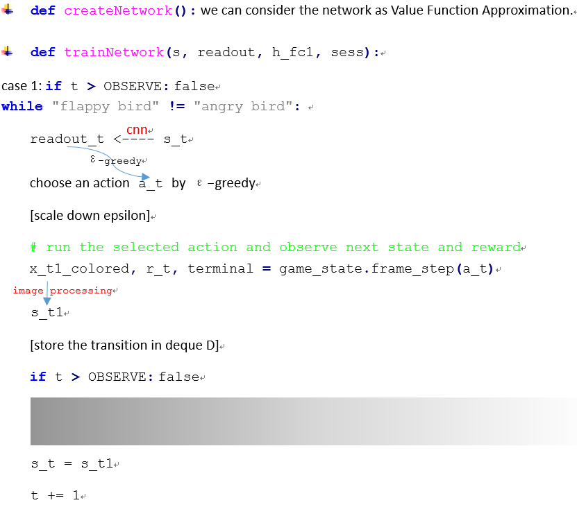
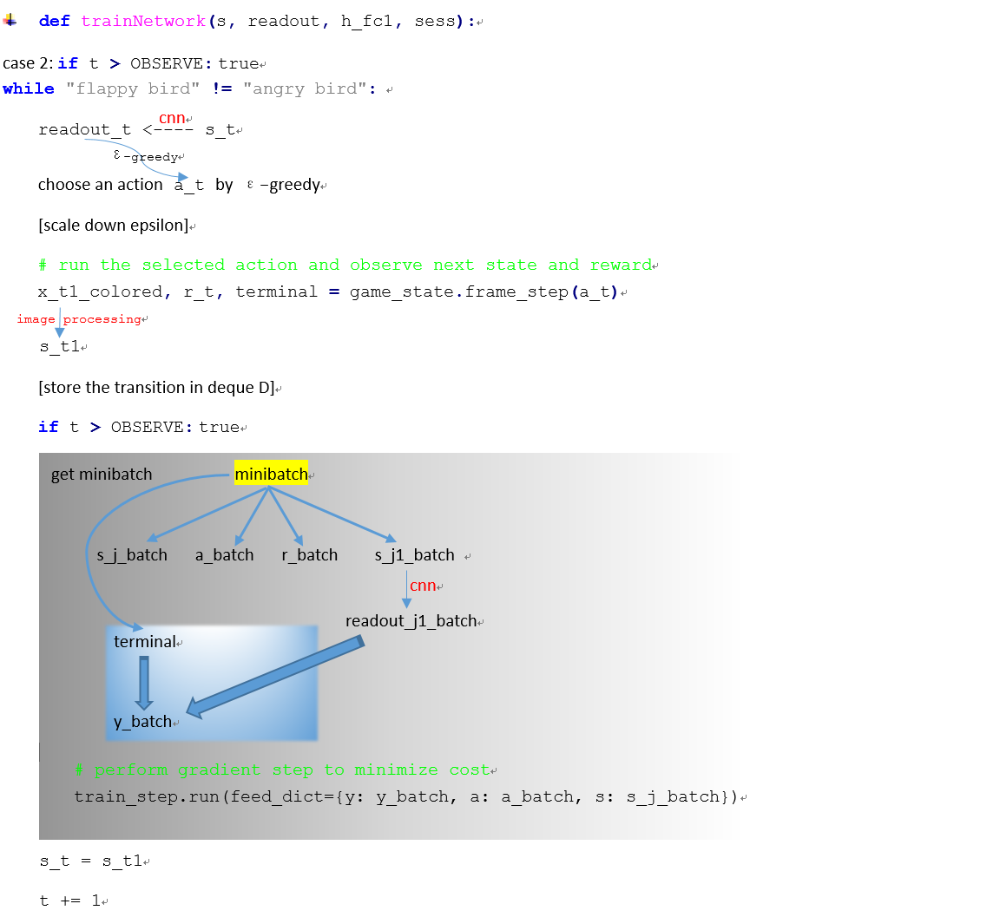

# Using Deep Q-Network to Learn How To Play Flappy Bird

## Overview
This project follows the description of the Deep Q Learning algorithm described in Playing Atari with Deep Reinforcement Learning [2] and shows that this learning algorithm can be further generalized to the notorious Flappy Bird.


## Installation Dependencies:
* Python 2.7 or 3
* TensorFlow 0.7
* pygame
* OpenCV-Python

### Some References you can look up
[1] Github: lupyanlab  [Install psychopy on Anaconda python](https://github.com/lupyanlab/lab-computer/wiki/Install-psychopy-on-Anaconda-python)

[2] DigitalOcean community  [How to Install and Configure VNC on Ubuntu 16.04](https://www.digitalocean.com/community/tutorials/how-to-install-and-configure-vnc-on-ubuntu-16-04)

## How to Run?
```
git clone https://github.com/ZhangRui111/DQNFlappyBird.git
cd DeepLearningFlappyBird
python deep_q_network.py
```

The program is running with pretrained weights by default. If you want to train the network from the scratch. You can delete `/saved_networks/checkpoint`. By the way, the training precess may take several days depending on your hardware.

## About deep_q_network.py





## Deep Q-Network Algorithm

```
Initialize replay memory D to size N
Initialize action-value function Q with random weights
for episode = 1, M do
    Initialize state s_1
    for t = 1, T do
        With probability ϵ select random action a_t
        otherwise select a_t=max_a  Q(s_t,a; θ_i)
        Execute action a_t in emulator and observe r_t and s_(t+1)
        Store transition (s_t,a_t,r_t,s_(t+1)) in D
        Sample a minibatch of transitions (s_j,a_j,r_j,s_(j+1)) from D
        Set y_j:=
            r_j for terminal s_(j+1)
            r_j+γ*max_(a^' )  Q(s_(j+1),a'; θ_i) for non-terminal s_(j+1)
        Perform a gradient step on (y_j-Q(s_j,a_j; θ_i))^2 with respect to θ
    end for
end for
```

